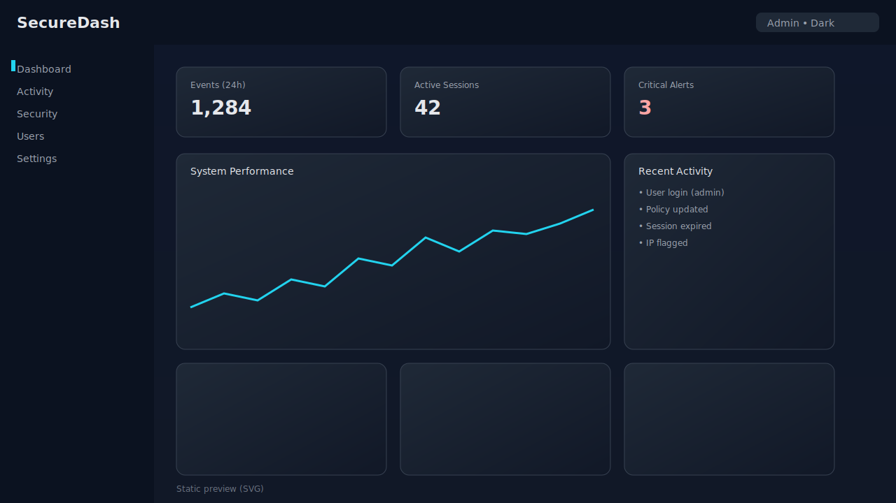

# SecureDash



A small full‑stack security dashboard I use for demos. It has an Express API, a Vite/React client, JWT auth, in‑memory storage (no DB needed to try it), and a clean UI.

## Features

- Authentication (JWT) with mock in‑memory users
- Protected API routes and role‑based example (admin)
- Dashboard metrics with real API calls
- Security alerts, activity logs, and user management pages
- System performance chart using Chart.js
- Dark/light theme toggle and basic settings persistence

## Tech stack

- Server: Express + TypeScript (tsx in dev, esbuild for prod bundle)
- Client: React + Vite + TailwindCSS + TanStack Query
- Charts: Chart.js + react-chartjs-2
- UI: Radix UI, Lucide icons

## Quick start

```bash
# 1) Install
npm install

# 2) Configure environment
cp .env .env.local  # optional; .env already present in this repo
# Edit .env and set a strong JWT_SECRET in production

# 3) Run dev (API + Vite dev server)
npm run dev
# Server binds to PORT=5000 by default (configurable via .env)

# 4) Build & run production
npm run build
npm start
```

## Default accounts (in‑memory)

- Admin: `admin` / `admin123`
- Viewer: `viewer` / `viewer123`

Defined in `server/storage.ts`. Do not use in production.

## Environment

`.env`
```
PORT=5000
JWT_SECRET=change-me-in-production
```

## Scripts

- `npm run dev` — Start the API (dev) and Vite client
- `npm run build` — Build client (Vite) and server (esbuild)
- `npm start` — Run the bundled server from `dist/`
- `npm run check` — Type-check with TypeScript
- `npm run db:push` — Example: run Drizzle schema push (optional)

## API Overview

- `POST /api/auth/login` — login with username or email + password
- `GET  /api/security-events` — list recent security events
- `GET  /api/activity-logs` — paginated activity logs
- `GET  /api/dashboard/metrics` — sample metrics
- `GET  /api/admin/users` — list users (admin only)

All protected routes require `Authorization: Bearer <token>`.

## Project structure

```
client/          # React/Vite app
server/          # Express API, Vite integration, routes
shared/          # Shared types/schemas
```

## Notes

- This is a demo app. Authentication is intentionally simplified.
- Swap the in‑memory storage for a real database when you need persistence.

## License

MIT
